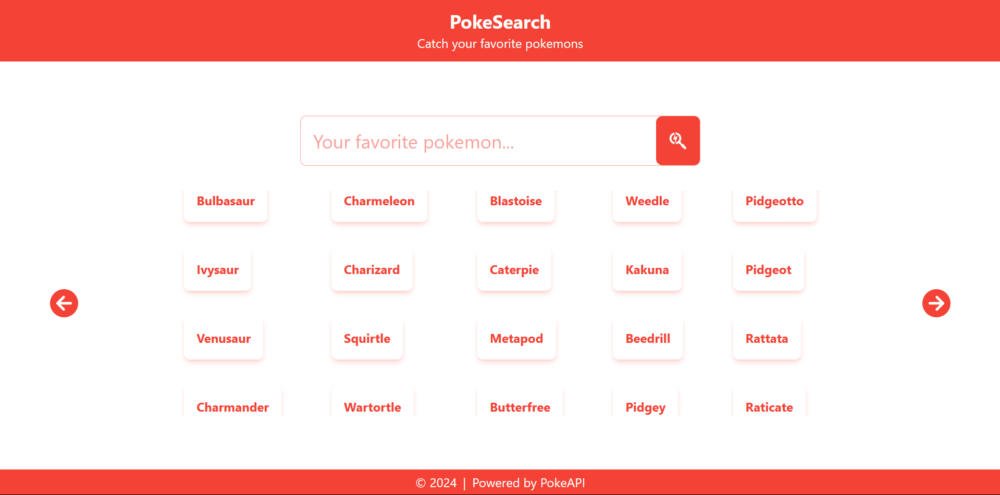
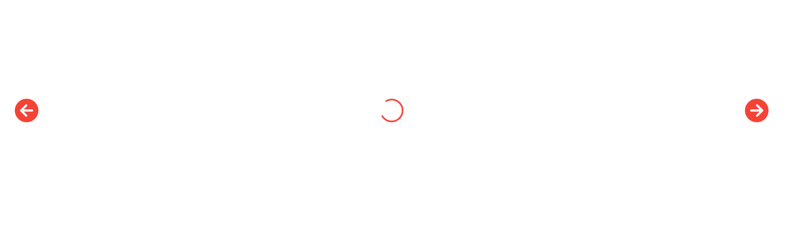
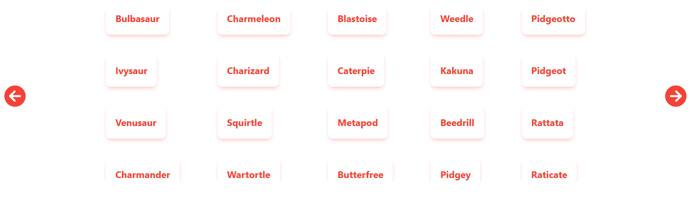
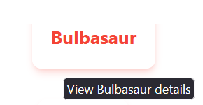
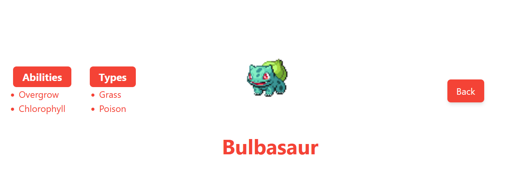
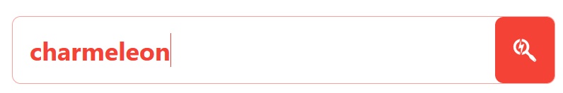
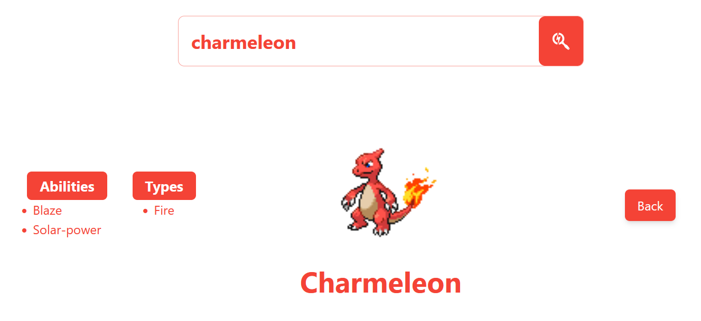
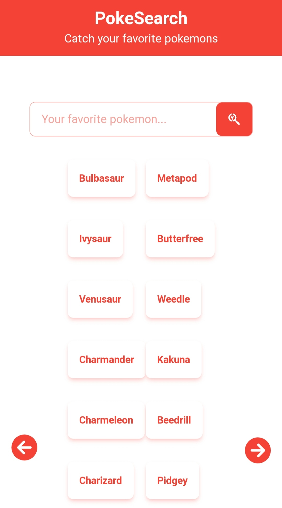
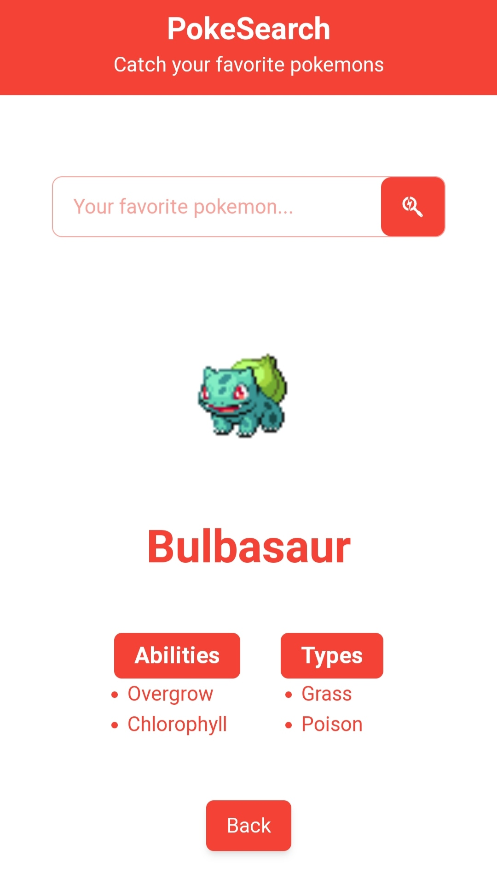

# PokeSearch

A simple pokemon app, built using Typescript, React, and TailwindCSS



## Demo

[poke-search-new.vercel.app](https://poke-search-new.vercel.app/)

## API

This project uses the Pokemon API from [PokeAPI](https://pokeapi.co/).

## Setup

### Initialize NPM

```bash
npm init -y
```

### Install Dependencies

The packages installed here are Typescript, React, TailwindCSS, as well as Parcel as the build tool.

```bash
npm install react react-dom
npm install typescript tailwindcss postcss parcel @types/react @types/react-dom --save-dev
```

### Create Config Files

Config files are created for Typescript (`tsconfig.json`), PostCSS (`.postcssrc`), and TailwindCSS (`tailwind.config.js`).

## Project Structure

The entry point of the app is `index.html`, located in the root of the project. This file sets up the scaffold for the root of the React app.

```html
<body>
    <div id="root"></div>
</body>
```

The source code is located in the `src` directory which are structured as follows:

```md
src/
├── assets/
│   └── (static assets)
├── components/
│   └── (React UI components)
├── hooks/
│   └── (custom React hooks)
├── layout/
│   └── (React layout components)
├── types/
│   └── (custom Typescript types)
├── utils/
│   └── (utility functions)
├── App.tsx (main React component)
├── index.tsx (Entry point of the React app)
└── style.css (main CSS file)
```

In the `index.tsx`, the root React element is created to render `App` component as the main component. Within the `App` component, the `Layout` component scaffolds the app's content with `Header` and `Footer` components. `style.css` serves as the main CSS file, primarily storing TailwindCSS properties.

## Project Features

There are two main features of this project:

1. Pokemon List
2. Pokemon Detail

Both features are implemented primarily within the `PokeArea` component. This component includes `PokeSearchBar` for user input of Pokemon names and `PokeDisplay` for displaying Pokemon data.

### Pokemon List

In the `PokeArea` component, the Pokemon list is fetched using the `usePokemonList` custom hook. This hook makes an API call to PokeAPI, fetching the list of Pokemon and return it along with the previous URL, next URL, and the loading state. The list is then passed as props to the `PokeDisplay` component. `PokeDisplay` would render each member of the list in the `PokeCard` component. The previous and next URL are used to fetch the previous or next list of Pokemon via API calls triggered by user interaction with corresponding buttons. Loading state is used to render a loading indicator conditionally if the data is not ready yet.




### Pokemon Detail

In the `PokeArea` component, Pokemon details are fetched using the `usePokemonDetail` custom hook. This hook makes an API call to retrieve detailed data for the selected Pokemon, and return the loading state as well. The fetched detail data is then passed as props to the `PokeDetail` component, which is responsible for rendering this information. Loading state is used to render a loading indicator conditionally if the data is not ready yet.

The selected Pokemon can be determined in two ways within the application:

- By clicking on a Pokemon card within the Pokemon list.
- By using the search bar provided in `PokeSearchBar`, which allows users to input the name of the Pokemon they want to get.

#### Selecting pokemon in the card





#### Searching pokemon in the search bar




## Responsiveness

This app is designed to be responsive, utilizing TailwindCSS media query classes to adjust layouts based on screen sizes.

### Mobile Appearance



